# pyplantuml

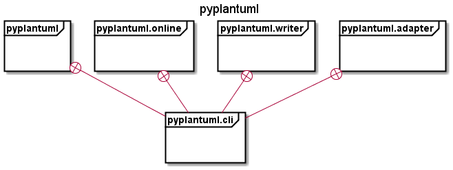

Creates UML diagrams (package and class structure) from Python source code.

Build on top of pylint's pyreverse to do the static code analysis and supports most of its original commandline interface.

It basically outputs plantuml description as text files instead of .dot files. The plantuml code features a simple syntax and is a great base for manual extension, e.g. to sketch out ideas on how to evolve the data model.

## Installation

From pypi:

    $ pip install pyplantuml

From source:

    $ python setup.py develop

After installation it is available from the commandline as two commands, see below.

## Dependencies

* [pylint](https://www.pylint.org/), for it includes [astroid](https://www.astroid.org/) and [pyreverse](https://www.logilab.org/blogentry/6883).

* [plantuml](http://de.plantuml.com/), to convert the resulting text files to images. It is enough to download the **plantuml.jar** and place it somewhere in a directory that is on your PATH, pyplantuml will then be able to find it.

## Usage

    $ cd <parent-dir-of-package>

    $ pyplantuml [pyreverse-options] <package>

        If a plantuml.jar can be found on PATH, it will automatically be
        called afterwards to convert the text files to images.

    $ pyplantuml-web [pyreverse-options] <package>

        Will use the online form on www.plantuml.com for conversion and
        display the result in your default browser. Do not use for sensitive data!

## Examples

pyplantuml is a great way to visualize the data structure of an existing package. It can be used on custom packages as well as builtins, as some of the examples below illustrate.

### ast
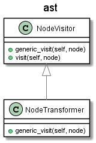

### logging
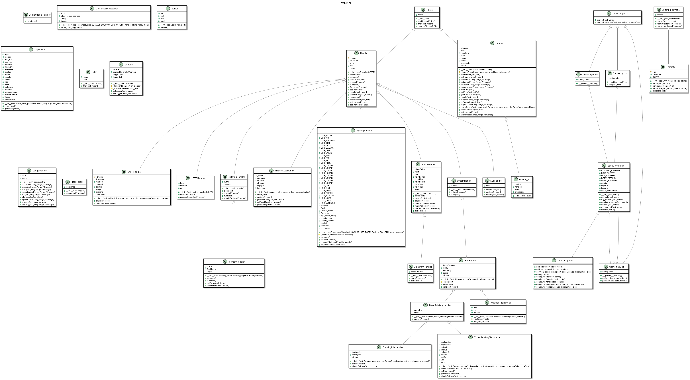

### maxjob
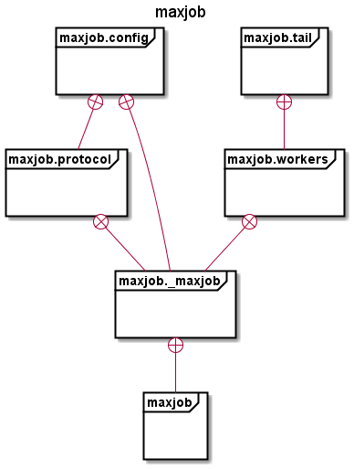
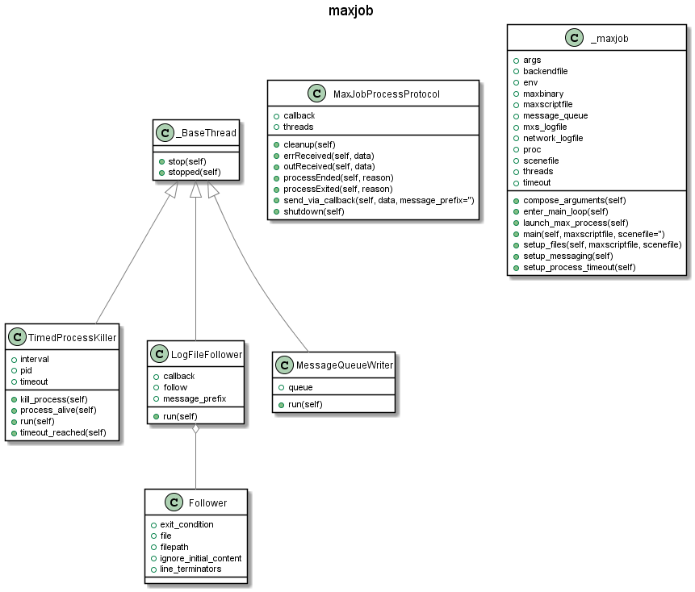

### pluggy
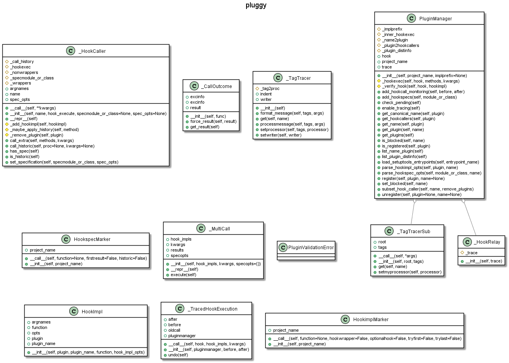

### re
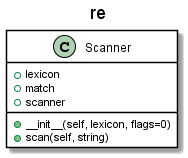

### setuptools
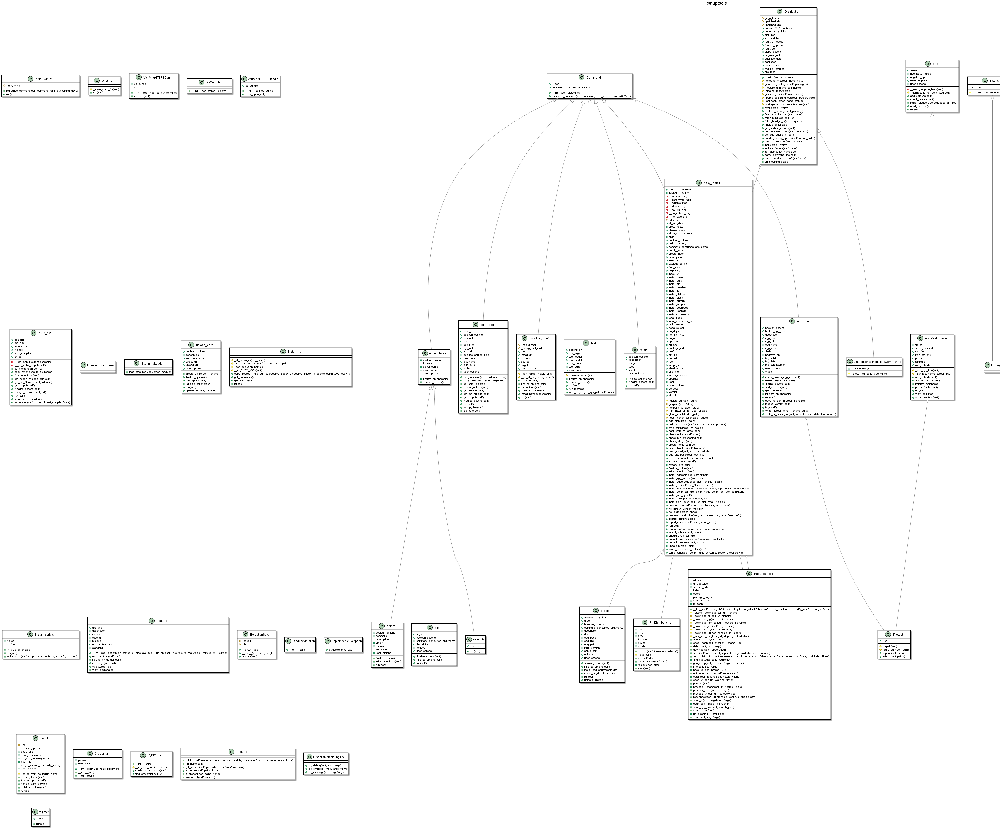

### SocketServer
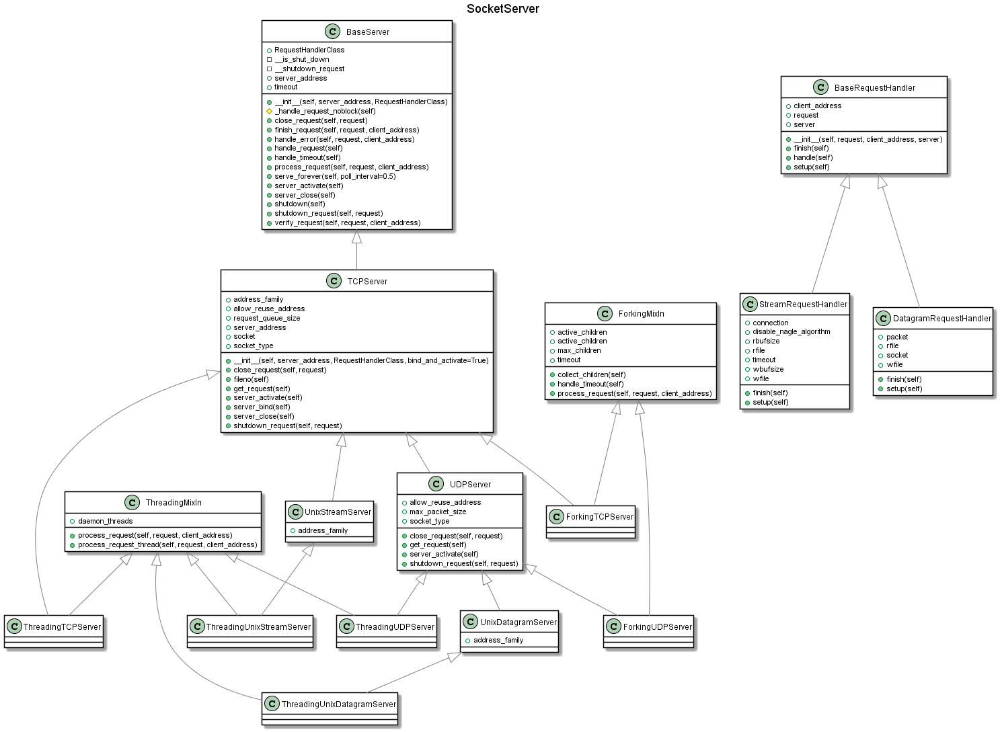

### tokenize
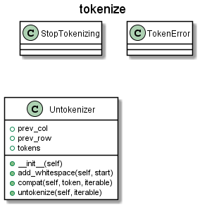

### tox
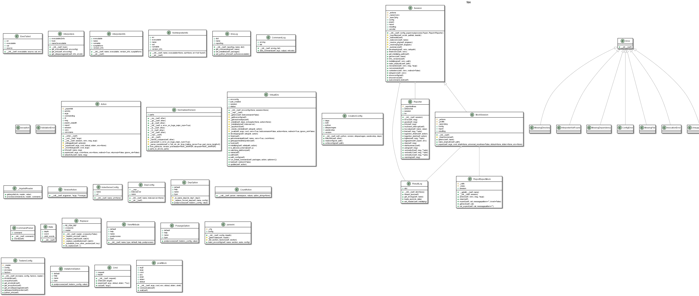

### urllib
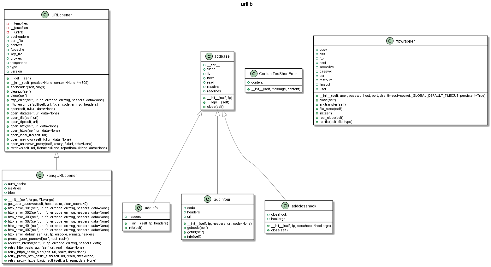

### webbrowser
